# robosim-at-home

An end-to-end robot learning studio for the [SO-100](https://github.com/TheRobotStudio/SO-ARM100) arm.

From teleop collection to reinforcement learning, one browser app covers the entire loop. Generate randomized scenes, collect data with a real leader arm, manage datasets, train **ACT** or **SmolVLA**, run online Flow-SDE **GRPO**, and evaluate policies. You have full control over objects, cameras, lighting, language instructions, and reward shaping — all sharing a single unified configuration and UI.

```bash
robosim
```

First launch downloads an asset pack, the demo ACT / SmolVLA checkpoints, and a 100-episode pick-and-place dataset, then opens [http://127.0.0.1:8000](http://127.0.0.1:8000).

<p align="center">
  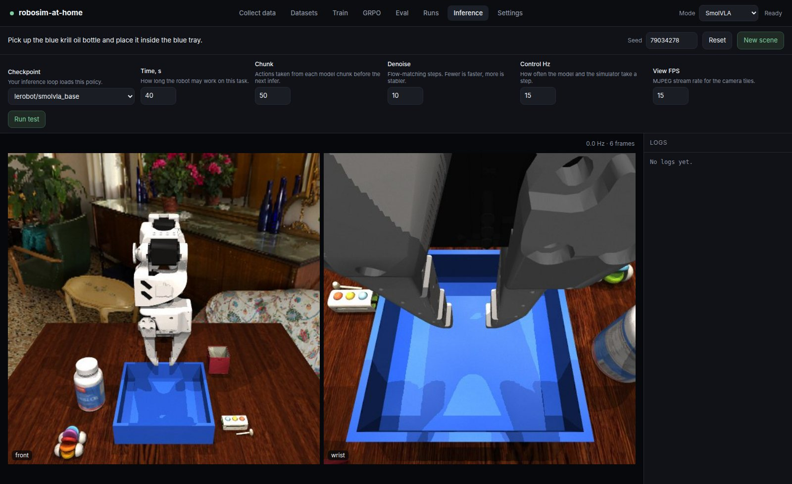
</p>

<p align="center">
  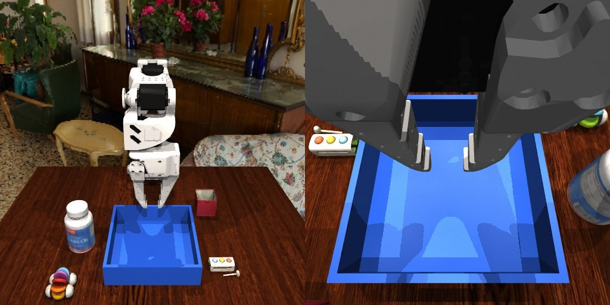
</p>

## The studio

| Page | What you do |
| --- | --- |
| **Collect data** | USB-detect and calibrate a SO-100 leader, spawn a scene, record front + wrist at a chosen Hz |
| **Datasets** | Create a local repo, import from Hugging Face, watch episode video, edit the task text, delete, sync |
| **Train** | ACT from scratch or continue a run. SmolVLA fine-tune, experts-only or full model. Multi-dataset, live loss |
| **GRPO** | Online Flow-SDE on a SmolVLA SFT checkpoint. Group rollouts, live cameras, per-member rewards |
| **Eval** | Build a fixed valset, reroll one scene, batch-score a checkpoint |
| **Runs** | Open any SFT / GRPO folder under `data/train`, charts and checkpoints, delete a run |
| **Inference** | New scene, pick a checkpoint, tune time / chunk / denoise / Hz, run a live test |
| **Settings** | The domain randomizer: objects, table, tray, room, lights, physics, cameras, language, rewards, compute |

Switch **SmolVLA ↔ ACT** in the header. GRPO and Eval stay hidden in ACT mode — ACT ignores language; the task string is a dataset label only.

## Quick start

You need [Docker](https://docs.docker.com/engine/install/) with Compose. Training, GRPO, and SmolVLA need an NVIDIA GPU and the [NVIDIA Container Toolkit](https://docs.nvidia.com/datacenter/cloud-native/container-toolkit/latest/install-guide.html). MuJoCo can render on NVIDIA, AMD, or Intel. A SO-100 leader on USB is optional until you collect.

After cloning this repository:

```bash
./robosim
```

The first run also installs a `robosim` command into `~/.local/bin`. Later launches from any directory are just `robosim`.

The installer asks for an asset pack:

| Pack | Size | Contents |
| --- | --- | --- |
| **Demo** | ~45 MB | 6 objects, 1 HDRI, 1 table — enough for the blue-krill task |
| **Full** | ~1.5 GB | All rooms, tables, and objects |

Both packs also pull:

- [PruhaNLP/SmolVLA-pickplace-blue-krill-demo](https://huggingface.co/PruhaNLP/SmolVLA-pickplace-blue-krill-demo)
- [PruhaNLP/ACT-pickplace-blue-krill-demo](https://huggingface.co/PruhaNLP/ACT-pickplace-blue-krill-demo)
- [PruhaNLP/pickplace-blue-krill-demo](https://huggingface.co/datasets/PruhaNLP/pickplace-blue-krill-demo)

Later launches skip the download and just start the container. If you installed Demo, it will offer the Full archive.

Port defaults to `8000`. Override with `ROBOSIM_PORT`.

## Collect

A wizard finds the lead USB (unplug / replug), connects, and calibrates home + joint ranges. Saved calibration can be reused. After that you generate scenes, pick a dataset, set Hz and the task, and hit Record.

<p align="center">
  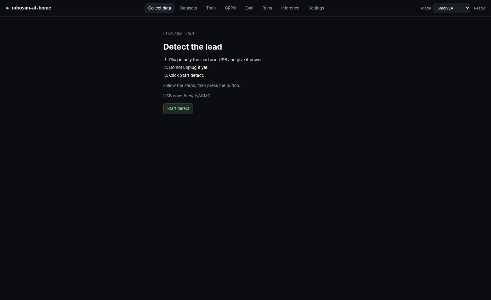
</p>

## Datasets

Local datasets for recording, or `org/name` from the Hub. Open an episode to play every camera, change the instruction, or drop a bad take. Hub copies can be synced back (that discards local edits).

<p align="center">
  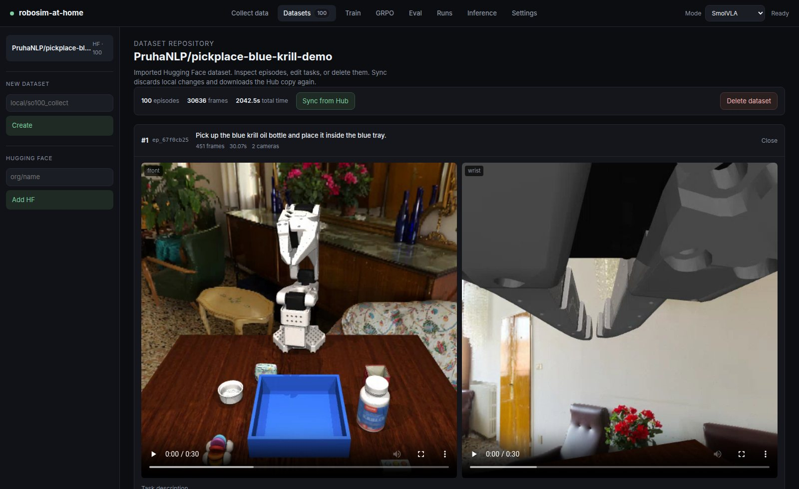
</p>

The starter set is [PruhaNLP/pickplace-blue-krill-demo](https://huggingface.co/datasets/PruhaNLP/pickplace-blue-krill-demo) — 100 episodes of “pick the blue krill oil, put it in the blue tray”.

## Train

Pick a checkpoint (`act` from scratch, `lerobot/smolvla_base`, a local run, or any HF / folder path), tick the datasets, set epochs / batch / LR / save interval. SmolVLA can freeze the VLM and tune experts only. Progress, loss, LR, and throughput stream in the page.

<p align="center">
  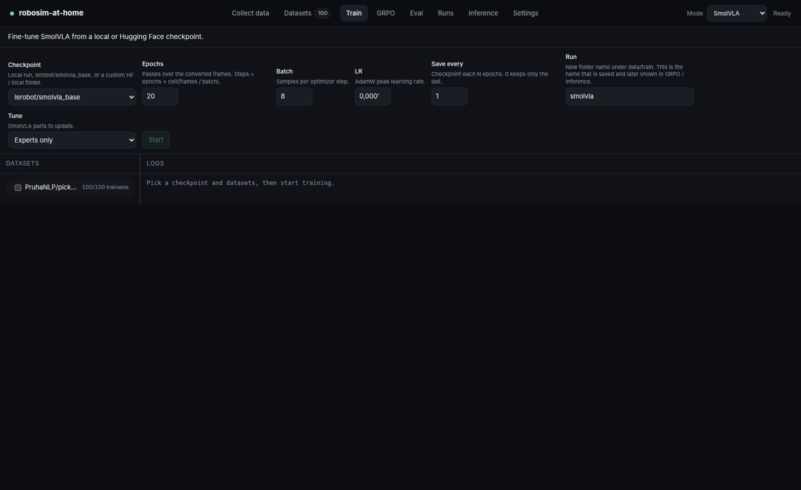
</p>

## GRPO

Loads an SFT SmolVLA, rolls out a group on the same generated scene, scores with the reward stack, and updates the flow policy. You control group size, how many members infer at once, how many scenes share an update, SDE mode (one random step vs all steps), noise, denoise steps, and expert LR. The group sidebar shows success / fail plus contact, proximity, progress, grasp, win, and hit penalty.

<p align="center">
  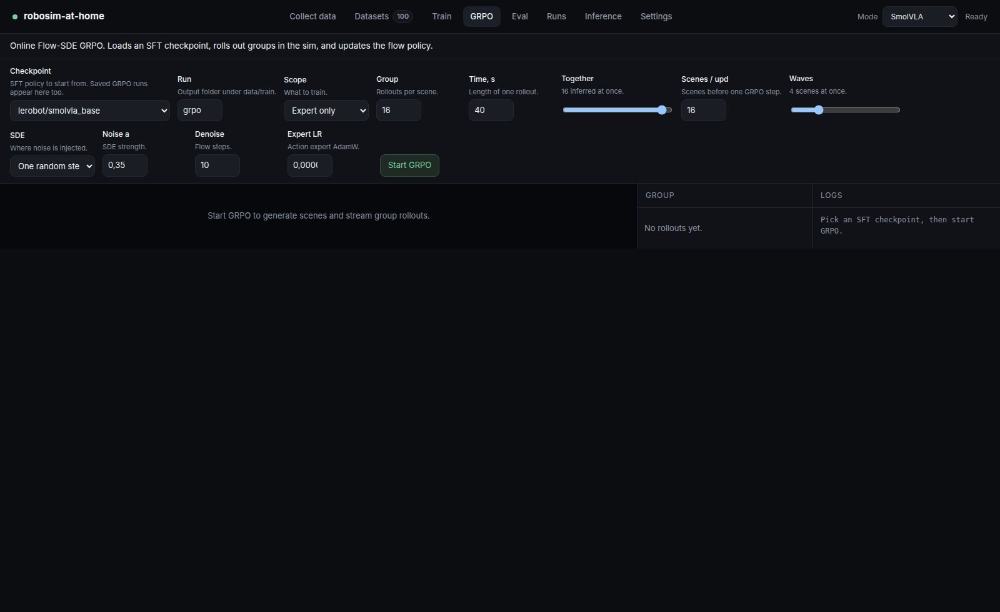
</p>

## Eval and runs

Eval builds a seeded valset of N scenes, lets you inspect stills and reroll a single scene, then runs the policy in parallel. Runs lists every folder under `data/train` with loss / reward / success charts.

<p align="center">
  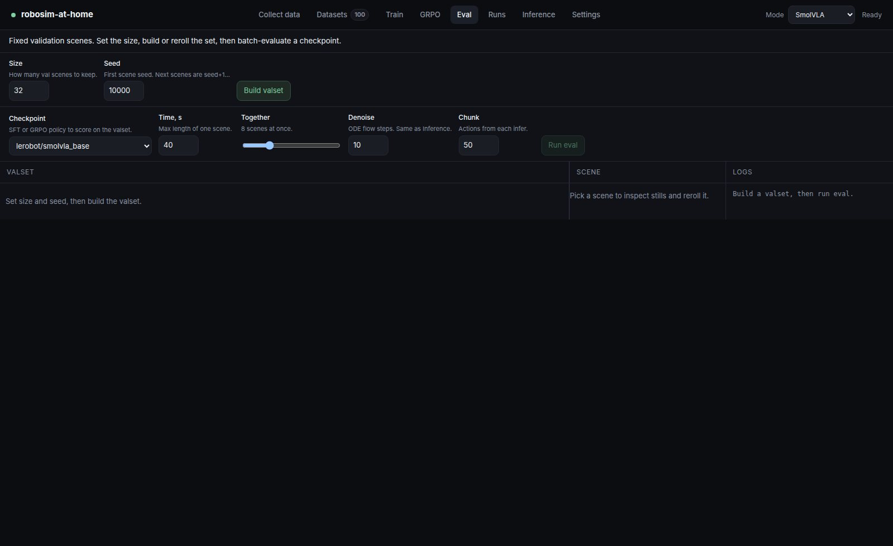
</p>

<p align="center">
  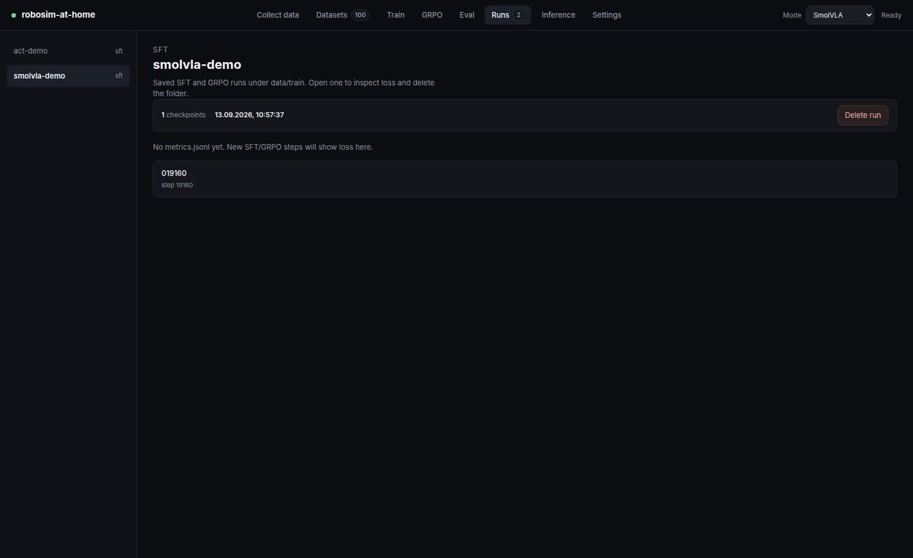
</p>

## Settings — this is the flexible part

Almost every knob that used to live in YAML is a field in the studio. Changing Scene / Cameras / Language rebuilds what Collect, GRPO, Eval, and Inference spawn next.

### Scene

One object catalog: tick **Target** vs **Distractor**, rename the object for the instruction (“blue krill oil bottle”). Then:

- distractor count, target / distractor size, spawn gap and robot exclusion zone
- table size, spawn rectangle, texture
- tray pose, cavity, wall height, random RGB
- room on/off, HDRI name, skybox resolution
- mass, friction, contacts, gravity
- lights: count or fixed XYZ list, color temperature, intensity, shadows, attenuation, headlight

<p align="center">
  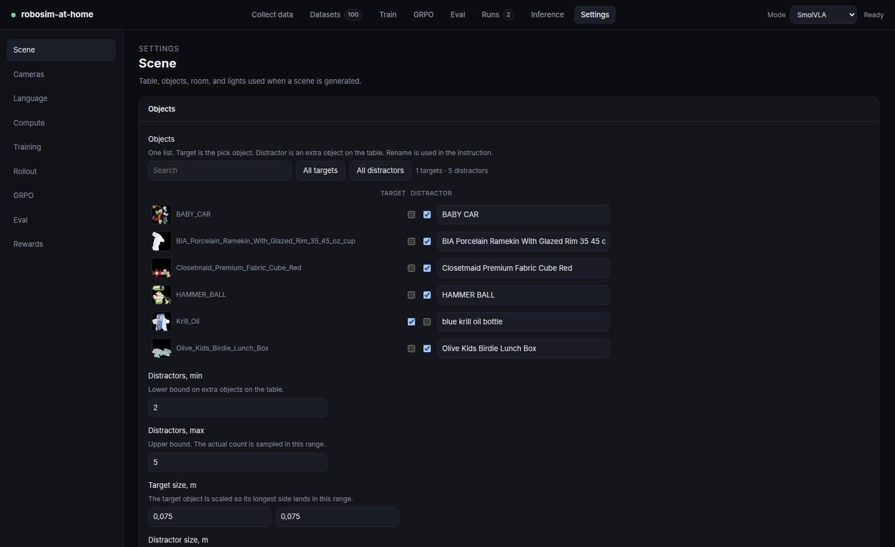
</p>

### Cameras

Six mounts: **front, wrist, overview, left, right, top**. Required cameras always spawn; extras are sampled. A shared **policy camera map** (`camera1`…`camera5`) is used by SFT, GRPO, and Inference — SmolVLA takes up to five filled slots, ACT takes the first N the checkpoint was trained with.

On top of that: FOV clamps per mount, position / look-at / roll jitter, wrist jitter, and three sensor profiles (budget webcam / midrange / clean) with ISO, shutter, vignette, distortion, dead pixels, JPEG quality.

<p align="center">
  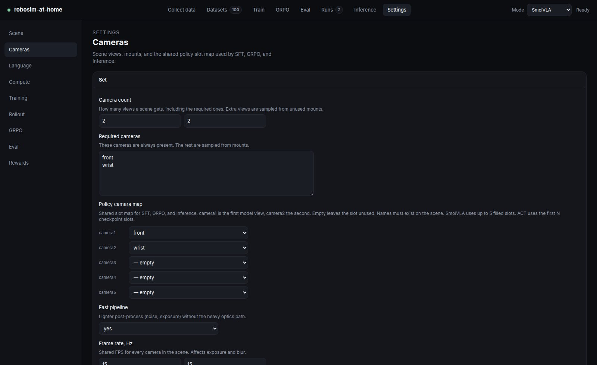
</p>

### Language, rewards, compute, training

- **Language** — instruction templates with `{target}` and `{destination}` (tray color is inferred from the mesh).
- **Rewards** — impulse penalty, pad contact, TCP proximity, progress toward the tray, grasp, and a success bonus that has to dominate shaping. Used by GRPO, Eval, and Inference tests, not by SFT.
- **Compute** — render GPU (needs a display engine) separate from the model GPU (CUDA). Auto is fine.
- **Training** — AdamW, cosine warmup / decay, AMP, SigLIP / frame caches.
- **Rollout** — episode length, control Hz, policy image size.
- **GRPO / Eval** — the same knobs as on those pages, plus optimizer, KL, checkpoint retention, smoke overrides.

<p align="center">
  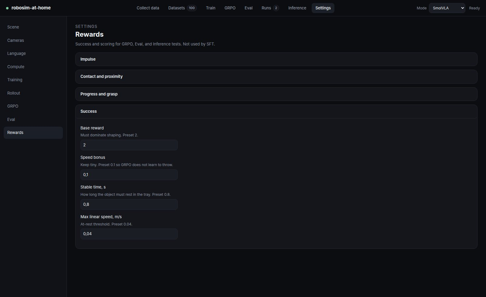
</p>

## Layout

```
robosim          # installer + studio launcher
ui/              # Vue studio + HTTP API
sim/             # MuJoCo scene, cameras, language, rewards
train_loop/      # ACT / SmolVLA SFT
grpo/            # Flow-SDE GRPO
eval/            # valset + batch eval
model/           # inference
assets/          # robot, objects, rooms, table (from the pack)
data/            # datasets, train runs, cache, scenes
```

## Assets and licenses

- Rooms and table textures: [Poly Haven](https://polyhaven.com), [CC0](https://creativecommons.org/publicdomain/zero/1.0/)
- Objects: [Google Scanned Objects](https://app.gazebosim.org/GoogleResearch/fuel/collections/Scanned%20Objects%20by%20Google%20Research), CC-BY-4.0
- Robot: [mujoco_menagerie](https://github.com/google-deepmind/mujoco_menagerie) `trs_so_arm100`, Apache-2.0

Packs live on the Hub: [demo](https://huggingface.co/datasets/PruhaNLP/robosim-at-home-assets-demo) · [full](https://huggingface.co/datasets/PruhaNLP/robosim-at-home-assets-full)
